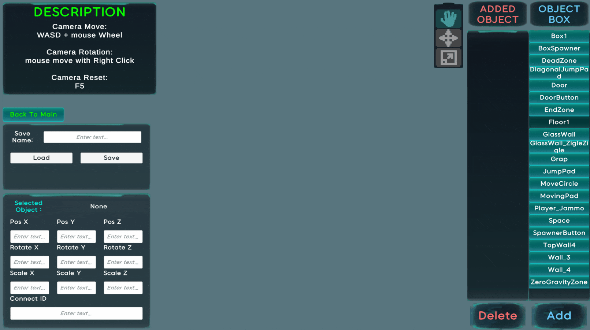
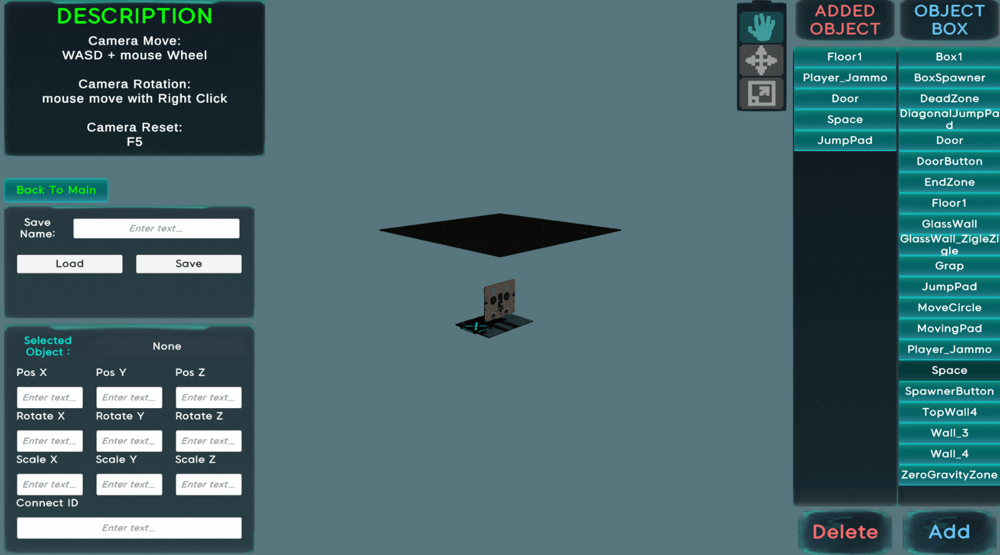

# 🎮 포탈 3

## 📌 장르  
1인칭 퍼즐 플랫포머 / FPS

## 🛠 개발 정보  
- **개발 환경:** Unity 2022.3.17f1  
- **개발 기간:** 2025.05.26 ~ 2025.05.30  
- **플랫폼:** Windows, MacOS  

---

## 🎮 조작법

| 키 | 기능 |
|----|------|
| WASD | 이동 |
| Space | 점프 |
| Esc | 설정창 열기 |
| E | 오브젝트 잡기 |
| 마우스 좌클릭 | 포탈 1 생성 |
| 마우스 우클릭 | 포탈 2 생성 |

> 🎞️ **[플레이어 이동]**
> 

> 🎞️ **[오브젝트 잡기]**
> 

---

## 🧩 주요 기능

### 🔵 포탈 시스템
- 렌더 텍스처 기반 포탈 구현
- **캐릭터 및 오브젝트의 공간 이동 가능**
- 포탈을 통한 창의적인 퍼즐 구성

> 🎞️ **[GIF: 포탈 생성, 플렐이어 이동]**
> 
> 🎞️ **[GIF: 포탈로 오브젝트 이동]**
> 

---

### 🧱 커스텀 맵 에디터
- 오브젝트 **추가, 이동, 회전, 크기 조절, 삭제** 가능
- 직접 만든 맵을 저장하고 플레이 가능

> 🎞️ **[에디터 사용 장면 - 생성, 위치 조절, 사이즈 조절]**
> 

---

### 📂 커스텀 맵 로드
- 에디터에서 만든 맵을 로드하여 플레이

> 🎞️ **[GIF: 커스텀 맵 로딩 및 플레이]**
> 

---

### 🧩 오브젝트 기능 모음

- **점프대**  
  → 플레이어가 올라가면 일정 높이로 수직 점프
  > 

- **방향 점프대**  
  → 설정된 방향으로 포물선 점프 (각도·높이 조절 가능)
  > 

- **이동하는 플랫폼**  
  → 지정된 경로를 따라 움직이는 플랫폼
  > 

- **큐브 스포너**  
  → 특정 버튼을 밟으면 큐브가 생성됨
  > 

- **에너지 볼**  
  → 플레이어가 맞으면 사망, 리스폰 지점으로 복귀
  > 

- **무중력 존**  
  → 진입 시 중력 제거, 특정 방향으로 힘을 받아 부유
  > 

- **설정 UI**  
  → 배경음 및 효과음 볼륨 조절 기능 제공
  > 

---

## 🛠 사용 기술 스택

- **DOTween**  
  → UI 및 문 등 다양한 애니메이션 처리  

- **직렬화/역직렬화**  
  → 커스텀 맵, 설정 정보 저장 및 불러오기  

- **Physics System / Transform / Quaternion**  
  → 포탈 시스템을 통한 위치 및 회전 계산  

- **Custom Shader**  
  → 런타임 맵 에디터용 Outline 및 기즈모 구현  

---

## 🧪 트러블 슈팅

| 이름       | 이슈 내용                                     |
|------------|-----------------------------------------------|
| 임예슬     | [포물선 점프 방향 오류](TroubleShooting/포물선점프방향오류.md) |
| 손유민     | [UI 애니메이션 적용 실패](TroubleShooting/UI애니메이션적용실패.md) |
| 박경택     | [커스텀 맵 데이터 로드 및 구조 분리](TroubleShooting/커스텀맵데이터로드및구조분리.md) |
| 백성은     | [포탈 이동 시 충돌로 인한 이동 불가](TroubleShooting/포탈이동시충돌로인한이동불가.md) |
| 김경민     | [플레이어 점프 시 벽 끼임 현상](TroubleShooting/플레이어점프시벽끼임현상.md) |

---

## 👥 만든 사람들

| 이름     | 담당 역할 |
|----------|------------|
| **백성은** | ・포탈 연출 및 시스템 구현 |
| **김경민** | ・플레이어 조작 및 튜토리얼 구성 |
| **박경택** | ・맵 로딩 및 동적 오브젝트 생성 ・씬 흐름 제어 (시작/클리어 등) |
| **손유민** | ・에너지 볼 구현 ・전체 UI 설계 및 애니메이션 |
| **임예슬** | ・맵 디자인 ・점프대, 이동 플랫폼 등 기믹 제작 |
| **김선우** | ・커스텀 맵 에디터 설계 및 기능 구현 |
